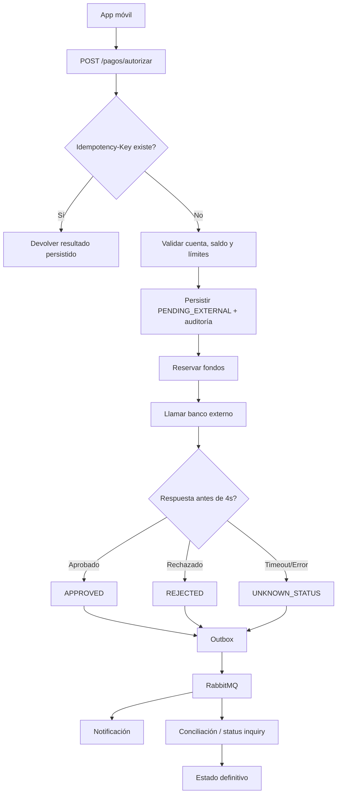

```mermaid
flowchart TD
 A[App móvil] --> B[POST /pagos/autorizar]
 B --> C{Idempotency-Key existe?}
 C -- Sí --> D[Devolver resultado persistido]
 C -- No --> E[Validar cuenta, saldo y límites]
 E --> F[Persistir PENDING_EXTERNAL + auditoría]
 F --> G[Reservar fondos]
 G --> H[Llamar banco externo]
 H --> I{Respuesta antes de 4s?}
 I -- Aprobado --> J[APPROVED]
 I -- Rechazado --> K[REJECTED]
 I -- Timeout/Error --> L[UNKNOWN_STATUS]
 J --> M[Outbox]
 K --> M
 L --> M
 M --> N[RabbitMQ]
 N --> O[Notificación]
 N --> P[Conciliación / status inquiry]
 P --> Q[Estado definitivo]
```
